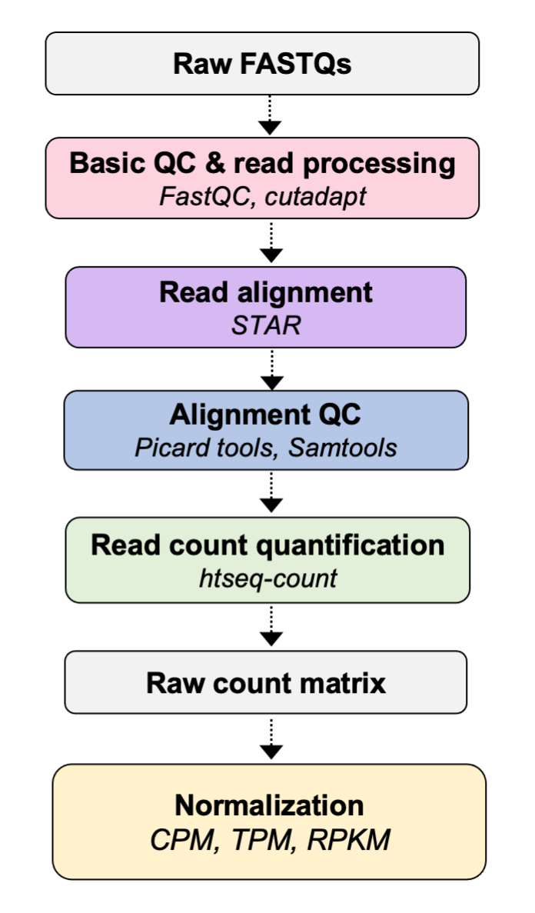

# Part 02 - Data management & setup

### Learning objectives:
- Familiarize yourself with the data set, directories, and set up your own working directory
- Understand the importance of good data management for RNA-seq analysis

Lets login to discovery7 and start and interactive session before we get started.  
```bash
# open a secure connection.
ssh d41294d@discovery7.dartmouth.edu

# log onto the J node that you have been assigned
srum q7
```

## Dataset for the workshop

We will be using the RNA-seq dataset described in [Himes *et al*, 2014, *PloS One*](https://journals.plos.org/plosone/article?id=10.1371/journal.pone.0099625). This study investigates the mechanism by which glucocorticoids, a major treatment used in asthma care, prevent inflammation of airway smooth muscle cells (ASM).

The authors sequenced 4 primary human ASM cell lines that were treated with a control vehicle (untreated), dexamethasone (Dex), albuterol (Alb), or both dexamethasone and albuterol (co-treated) for 18 hours before sample collection (although only Dex samples are considered in the paper). They then use differential expression analysis to identify >300 differentially expressed genes (DEGs).

Although we won't be performing a differential expression analysis of these data in the workshop, it is still useful top understand the overall study design, depicted below:


## Raw data

Raw sequence data was obtained from the [*Sequence Read Archive*](https://www.ncbi.nlm.nih.gov/sra)
[SRA toolkit](https://github.com/ncbi/sra-tools) (SRA) under project accession [SRP033351](https://www.ncbi.nlm.nih.gov/sra?term=SRP033351). The raw FASTQ files are locted in `/scratch/rnaseq1/data`. Each sample is named according to their **SRR** identifier from the SRA. SRR (SRA run accession) identifiers are used to denote objects containing actual sequencing data from a sequencing run.

If you would like to learn more about how to obtain publicly available data from the SRA, you should consult the [NCBI download guide](https://www.ncbi.nlm.nih.gov/books/NBK242621/).

Normalized count data are also available from the Gene Expression Omnibus (GEO) for this dataset under accession [GSE52778](https://www.ncbi.nlm.nih.gov/geo/query/acc.cgi?acc=GSE52778).

Although we won't use it for this project, if pre-processed data is available (e.g. raw or normalized counts) for a public dataset, it can save you time performing the primary data analysis (although you have to trust they did most of it right).

```bash
# lets have a look at the project directory containing the raw FASTQs
ls -lah /scratch/rnaseq1/data/raw-fastq/
```

Since these are paired-end reads (we will talk more about this) each sample has a file for read 1 (SRRXXX_1) and a file for read 2 (SRRXXX_2). All of the files are `gzipped` in order to reduce the disk space they require, which is important as you can see that they are all generally at least **1GB** (you need a lot of space to process RNA-seq, or other-NGS data).

## Metadata

In addition to the raw sequence data in FASTQ format, datasets should always have an associated metadata file. *Metadata* refers the variables that describe individual sample characteristics.

Metadata, are required so that we know how to process the data appropriately, how to make key quality assessments, or set up the downstream analysis. A snippet of the metadata file for this project is shown below:

| Sample     | Organism.Name | … | Instrument          | Library.Source | tx.group  |
|------------|---------------|---|---------------------|----------------|-----------|
| SRR1039508 | Homo sapiens  | … | Illumina HiSeq 2000 | TRANSCRIPTOMIC | untreated |
| SRR1039509 | Homo sapiens  | … | Illumina HiSeq 2000 | TRANSCRIPTOMIC | Dex       |
| …          | …             | … | …                   | …              | …         |
| SRR1039521 | Homo sapiens  | … | Illumina HiSeq 2000 | TRANSCRIPTOMIC | Dex       |
| SRR1039522 | Homo sapiens  | … | Illumina HiSeq 2000 | TRANSCRIPTOMIC | Alb       |
| SRR1039523 | Homo sapiens  | … | Illumina HiSeq 2000 | TRANSCRIPTOMIC | Alb_Dex   |

You can find the complete file in the GitHub repo: `misc/sample_metadata.csv`

### Some key metadata for these data (from the paper and SRA entry):
- ***Primary ASM cells*** were isolated from lung transplant donors with no chronic illness  
- ***Passages 4 to 7*** ASM cells maintained in ***Ham's F12 medium*** supplemented with 10% FBS  
- For treatment with Dex, cells were treated with ***1uM Dex*** or ***control vehicle*** for 18 hours (4 replicates in each group).
- RNA was harvested and prepared into cDNA libraries using the ***Illumina TruSeq RNA Sample Prep Kit v2***
- Libraries were sequenced using 75-bp paired-end reads on an ***Illumina Hiseq-2000***

## Analysis overview

We will pre-process the raw sequence data, assess its quality, and reduce it to a matrix of raw read counts that can be used for downstream analyses, such as differential expression.



As we move through the analysis, we will be generating intermediate files for each of these steps. You will use the directory you created in `/scratch/` to run your analyses and store you results. Navigate to that directory from wherever you are now.

```bash
# navigate to scratch
cd /scratch/

# go into it
# remember to use your own initials - this is Owen's directory
cd omw

# set an alias so we can get here quickly
alias rnaw='cd /scratch/omw/'
```

We need to set up some sub-directories where we will conduct each step. The desired directory structure for the workshop looks like this:
```bash
omw
  ├── raw_data
  ├── results
  └── scripts
```

Lets make the subdirectories:
```bash
mkdir raw_data results scripts
```

We will use Symbolic links (sym links) to link the raw data in `/scratch/rnaseq1/data/raw-fastq` to the directory we created for ourselves in scratch. Sym links provide a way of linking to distant files from within a directory that they do not actually exist inside. Since most genomics data is very large, it is impractical to move it around and copy it, so we use Sym links to point to files as if they were in our current directroy.

Look in `/scratch/rnaseq1/data/raw-fastq`
```bash
ls -lah /scratch/rnaseq1/data/raw-fastq
```

You can see that the raw data for all samples is there, although, as we mentioned, it is very large, and each step in processing individual files can take a long time, so we will only use a subset of these data during the pre-processing of the data.

Specifically, we will be using 8 FASTQs from 4 samples (2 controls, 2 Dex) that only contain reads aligning to chromosome 20. These files are located in `/scratch/rnaseq1/data/raw-fastq/subset` and are much smaller so that we will be able to complete time consuming steps like read alignment to the reference genome, in a practical time period.

Set up sym links to the raw FASTQs:
```bash
# have a look at the files
ls -lah /scratch/rnaseq1/data/raw-fastq/subset/

# set up the sym link in your raw_data directory
cd raw_data/
ln -s /scratch/rnaseq1/data/raw-fastq/subset/*fastq.gz ./

# have a lok at the links in your directory
ls -lah
```

For each step of the analysis in day 1, you can see we have included all of the files generated at each step for each sample in `/scratch/rnaseq1/data/`. While we will only use some of this data during day 1 of the workshop, we've made the entire processed dataset available if you want to practice with it, or try to replicate it yourself. We will leave this on `scratch` for about 1 month before removing it.

You should have also created a `conda` environment called `rnaseq1` by following the guidance in the workshop setup. `conda` is an excellent way to manage software versions, especially on high performance computing systems. It is critical you **know AND track** which version of software you use for an analysis. Not only do you need to report this when you publish your work, but is also important for anyone trying to reproduce your work.

Activate the conda environment:
```bash
conda activate rnaseq1
```
If you don't know what rnaseq1 is, please visit [here](https://github.com/Dartmouth-Data-Analytics-Core/RNA-seq_workshop_July2020/blob/master/welcome-%26-setup.md).

We are now ready to start working with the data and processing the raw FASTQ files.


## Downloading the workshop materials (optional)

Although not required since the workshop materials will remain available on the [GitHub repository](https://github.com/Dartmouth-Data-Analytics-Core/RNA-seq-Primary-Data-Analysis-workshop-June-2021), you may download the workshop materials to your local computer. In your terminal window, navigate to where you want to download the files on your local machine. Then execute the following command:

```bash
git clone https://github.com/Dartmouth-Data-Analytics-Core/RNA-seq-Primary-Data-Analysis-workshop-June-2021/
```

If it is unclear how to do this, it should become more clear after our 'Shell' lesson on day 1.

**NOTE:** We will be updating the materials in the week proceeding the workshop to get everything ready, therefore if you choose to download the workshop materials, please make sure to do this again after the workshop has started to get the most up-to-date version.
