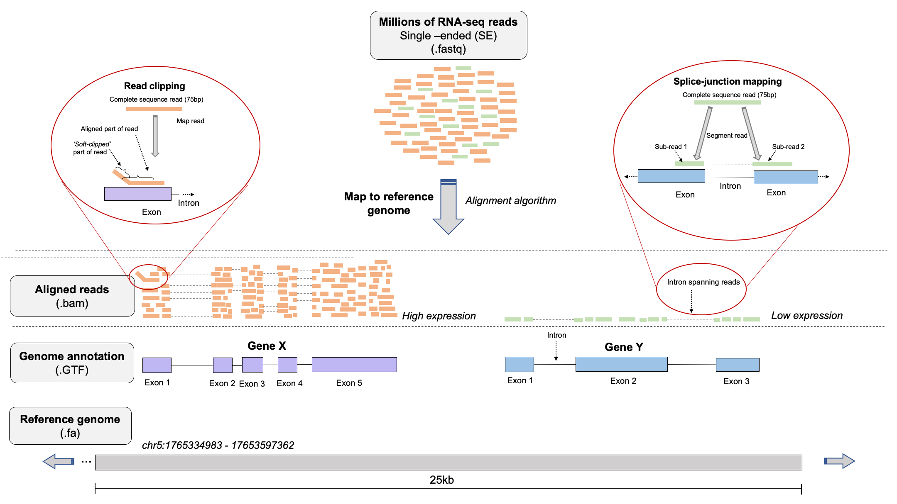

# Read mapping & alignments  

### Learning objectives:
- Understand the major principles behind read mapping for RNA-seq data
- Learn how alignment data is stored in SAM/BAM format
- Learn how to perform basic operations on BAM files using `Samtools`
- Perform an alignment with `STAR`
- How to view alignments using the `Integrative genomics Viewer (IGV)`

Make a new directory to work in:
```bash
# go to our home dir for the wrkshop
rnaw

# make the directory and cd into it
mkdir results/alignment
cd results/alignment
```
If you get lost, or do not have enough time to finish the commands before we move to the next session you can copy the files needed for the next step with the following command from the scratch directory you have created for yourself.

```bash
cp /dartfs-hpc/scratch/rnaseq1/data/bam/*	results/alignment/
```

## Principles of read mapping for RNA-seq
The goal of mapping reads to a reference genome is to find the **most likely location in that reference genome where the read originated from**. For RNA-seq, this means we try to find the most likely location in the reference genome that transcribed the RNA fragment which ultimately ended up in our cDNA library.

Although we won't go into theory here, aligning reads to reference genomes involves **mapping** to identify the most likely position of the read in the reference genome, followed by the **alignment**, which describes the base-by-base relationship between the read and the reference. Alignments are often imperfect, and are associated with quality scores (**MAPQ scores**) that describe the quality of the alignment.

The cartoon below depicts a typical read mapping scenario for an RNA-seq experiment.



**Challenges of aligning millions of short reads to a reference genome involve:**
- Mismatches introduced by genetic variation and sequencing errors
- Repetitive sequences in genomes (e.g. start and end of chromosomes)
- Presence of intron in reference genomes, meaning aligners must be able to consider splice-junctions

Numerous aligners exist that strike a balance of various features to address these challenges. It is important to choose one that is appropriate for your dataset. Importantly, some aligners are **splice-aware** while others are not. **Splice-aware** aligners can generate alignments to a reference genome that span the intronic regions and therefore account for splicing, e.g. `STAR` and `HISAT2`.

If your dataset is prokaryotic (non-splicosomal) you would **not** want to use a splice-aware aligner, and instead using an aligner that is not designed to map across intronic regions such as `bwa-mem` or `bowtie2` (more on this later).


# What if no reference genome is available?


### Concepts for read alignment

#### Read clipping
Aligners are capable of 'clipping' reads from sequence ends if they do not improve the quality of an alignment that exists for the rest of the sequence.  

Types of clipping:  
- **Soft-clipping**: bases at 5' and 3' ends of the read will be kept in the read sequence in the BAM file, but are NOT part of the alignment
- **Hard-clipping**: bases at 5' and 3' ends of the read will be removed from the BAM file altogether and are NOT part of the alignment

<p align="left">

</p>

Such clipping is commonly used by aligners to get rid of sequence contamination, e.g. ***adapter sequences*** or ***polyA tails*** from mRNAs, so that it does not affect the alignment. At least for RNA-seq, this is why you do not necessairily need to be very aggressive in read trimming and pre-processing steps.

Clipping can be very advantageous, but also can potentially cause some issues, read more [here](https://sequencing.qcfail.com/articles/soft-clipping-of-reads-may-add-potentially-unwanted-alignments-to-repetitive-regions/).

#### Splicing
As discussed above, numerous aligners exist, consisting of both ***splice-aware*** and ***splice-unaware*** aligners. Splice-aware aligners, such as `STAR` and `HISAT2` will produce alignments spanning splice junctions, which is obviously an important characteristic that the aligner needs to be able to account for in the human RNA-seq dataset that we are working with today. Furthermore, if you provide coordinates of splice-junctions to aligners like `STAR`, it can improve the mapping over spliced regions and improve detection of novel splice-functions.

<p align="left">

</p>

#### Genome vs transcriptome mapping?
While there are times when one may want to map to a transcriptome, there are issues with this approach.  
- If your annotated transcriptome is not complete, you may fail to map some reads simply because the sequences aren't in your reference, which would not be an issue if you mapped to the genome.
- With multiple splice isoforms it is difficult to disambiguate which splice isoform a read should be aligned to in transcriptome mapping.
- You cannot identify novel transcripts this way.

#### What input do I need for an alignment?
At miniumum:  
- `FASTQ` file(s)
- A reference genome (`.fasta`)

Optional:   
- `.gtf` file for the reference genome that species the genomic feature annotation. As mentioned above, if you know where the splice-junctions in your genome are, you can give this to aligners such as STAR and they will use this information to improve the quality of mapping in these regions.


#### Alignment file formats

Alignments are stored in the **SAM (.sam)** and **BAM (.bam)** file format. **SAM** stands for **Sequence Alignment/Map)** format, essentially a tab-delimited text file (human readable file).

**BAM** files are **compressed, indexed, binary version** of SAM files and are NOT human readable, but are much faster to parse and do complex downstream operations on. You can read all about the SAM/BAM file format specification in the documentation [here](https://samtools.github.io/hts-specs/SAMv1.pdf).

SAM/BAM files contain a number of slots for each alignment that describe its characteristics. 11 slots are mandatory, while others are optional and depend on the aligner and settings used.


The image for the example BAM file is adapted from the [SAM/BAM file format documentation](https://samtools.github.io/hts-specs/SAMv1.pdf)

#### Notes on select fields:

**FLAG**:  
Encodes important information about the read, for example, is it a ***primary***, ***secondary***, or ***supplementary*** alignment. Since a single read will likely have a number of properties that we want to ***'flag'***, SAM files use a special way of encoding the FLAG field to pack as much information as possible into a single number. While we won't go into detail on this here, SAM/BAM file use a *bit-wise* system to combine information across flags into a **single integer**. I encourage you to go read more about FLAGs and how they are specified in the SAM/BAM documentation.

The Broad institute provides an [excellent tool](https://broadinstitute.github.io/picard/explain-flags.html) for decomposing SAM flags into the proprties of the read that make up a specific `FLAG` value.

This command will provide basic information on FLAGs from samtools.
```bash
samtools flags
```
The values shown here relate the the [hexadecimal system](https://www.electronics-tutorials.ws/binary/bin_3.html)

#### MAPQ:   
Corresponds to the quality of the mapping. These are calculated in the same way as the Phred scores `Q = -10 x log10(P)`, although are generally considered to be a best guess from the aligner. A MAPQ of 255 is used where mapping quality is not available. Some aligners also use specific values to represent certain types of alignments, which may affect use of downstream tools.

We won't go into MAPQ scores in detail here however [this article](http://www.acgt.me/blog/2015/3/17/more-madness-with-mapq-scores-aka-why-bioinformaticians-hate-poor-and-incomplete-software-documentation): `(More madness with MAPQ scores (a.k.a. why bioinformaticians hate poor and incomplete software documentation)` nicely summarizes some of the differences between MAPQ scores generated by different aligners.

#### CIGAR  
An alphanumerical string that tells you information about the alignment. For relatively short reads, these are nice, but for long reads, they are a headache. Numbers correspond to number of bases, and letters correspond to features of those bases.  

CIGAR value | Meaning
------|------
M | match or mismatch  
S | soft clip  
H | hard clip  
I | insertion  
D | deletion  
N | skipping  

So for example, alignment in row 3 of our SAM file example above (`5S6M`) would describe an alignment where 5 bases are soft-clipped, followed by 6 matching bases.

### STAR (Spliced Transcripts Alignment to a Reference)
STAR is a very flexible, efficient, and quick read aligner. It uses a method of seed searching, clustering, stitching, and scoring to find the most probable match in the reference sequence for each read.

STAR is a gapped aligner that is capable of generating alignments spanning introns but can allow for shorter mistmatches such as SNPs, INDELs, or incorrect base calls. Read contamination, adapter sequences, or low quality bases can all be removed from alignments by soft-clipping.

You can find the STAR user manual [here](https://github.com/alexdobin/STAR/blob/master/doc/STARmanual.pdf) and the original manuscript [here](https://academic.oup.com/bioinformatics/article/29/1/15/272537).

#### Constructing a genome index

Before mapping your reads with STAR, you must create an index of your reference genome, and specify the location of this index when you run the aligner. The index is in principle similar to how one might index a book, so that specific items or information can be found more quickly. For the genome index, we are indexing the genome so that the aligner can narrow down where a read may map to and speed up mapping.

For the purposes of this workshop and saving time, we have pre-built created a small genome index consisting of only chromosome 20, and will be using a subset of the total reads sequenced for sample `SRR1039508` which are known to align to chromosome 20. In practice you would use the entire genome to generate the index. This step is time consuming so we won't run it now, but the command used to create the index we will use is:
```bash
### DO NOT RUN DURING WORKSHOP (TIME CONSUMING:)
STAR --runThreadN 16 \
  --runMode genomeGenerate \
  --genomeDir hg38_chr20_index \
  --genomeFastaFiles Homo_sapiens.GRCh38.dna.primary_assembly.chr20.fa \
  --sjdbGTFfile Homo_sapiens.GRCh38.97.chr20.gtf \
  --genomeSAindexNbases 11
```

Option details:
- `--runThreadN`: no. of core/threads you want to use
- `--runMode`: the mode you want to run STAR in (for index generation, this should be genomeGenerate)
- `--genomeDir`: directory you want your genome to go to
- `--genomeFastaFiles`: path to genome .fasta
- `--sjdbGTFfile`: path to genome annotation in .gtf format
- `--sjdbOverhang`: default is 100, usually set to the readlength -1

You can find the pre-built index at `/dartfs-hpc/scratch/rnaseq1/refs/hg38_chr20_index/`.

Once you have generated an index, it is best not to do anything with it, except tell STAR where it is when you want to align reads.

#### Aligning the reads

We are ready to align our reads to the genome, using the subset of reads sequenced for sample `SRR1039508` that are known to align to chromosome 20 (files: `SRR1039508_1.trim.chr20.fastq.gz` and `SRR1039508_2.trim.chr20.fastq.gz`).

```bash
STAR --genomeDir /dartfs-hpc/scratch/rnaseq1/refs/hg38_chr20_index \
  --readFilesIn ../trim/SRR1039508_1.trim.chr20.fastq.gz ../trim/SRR1039508_2.trim.chr20.fastq.gz \
  --readFilesCommand zcat \
  --sjdbGTFfile /dartfs-hpc/scratch/rnaseq1/refs/Homo_sapiens.GRCh38.97.chr20.gtf \
  --runThreadN 1 \
  --outSAMtype SAM \
  --outFilterType BySJout \
  --outFileNamePrefix SRR1039508.
```

> *NOTE:* I usually set `outSAMtype` to `BAM SortedByCoordinate`, so that I do not need to convert the default SAM file output by STAR to BAM, then sort it. However, since we want to look inside the file at the alignments, we are creating a SAM first, and will convert to a BAM afterwards.

Option details:
- `--genomeDir`: the path to the directory with genome indices
- `--sjdbGTFfile`: the path to the annotation file that includes cooordinates of splice-junctions
- `sjdbOverhang`: length of the sequence around the splice junction to be used in constructing the splice junctions database
- `--runThreadN`: number of threads to use in the run
- `--outFilterType`: how mapped reads will be filtered (normal/BySJout)
- `--outSAMtype`: (SAM/BAM unsorted/ BAM SortedByCoordinate)
- `--readFilesIn`: read files to map to reference alignment
- `--readFilesCommand`: uncompression command to apply to read files
- `--outFileNamePrefix`: prefix for outfiles generated in the run

Now, wait...

There are a number of other options you may wish to specify, depending on your application and downstream analysis. These are the barebones options suggested for RNA-seq and optimized for mammalian genomes. Again, I encourage you to go look through the [user manual](https://github.com/alexdobin/STAR/blob/master/doc/STARmanual.pdf) if you plan to use STAR.

**Aligment output**

Once the alignment has finished, you should have a number of new files in your directory. These are composed of:  
- `.sam` - your alignment file
- `Log.out` - the log of the STAR run
- `Log.final.out` - the summary file of the mapping statistics
- `Log.progress.out` - a summary file that is updated with key mapping statistics as the run progresses
- `SJ.out.tab` - high-confidence splice-functions

It is very important to do a detailed quality control review of your alignments across all your samples to identify any potential issues. We are going to (later) build a detailed multi-sample QC report using an independent tool, however we can have a quick look at the `Log.final.out` file from STAR as this contains the major mapping stats that we want to look at to assess how well reads were mapped to the reference.

```bash
cat SRR1039508.Log.final.out
```

**Working with SAM/BAM files**  
We can also have a look around our SAM file to get to know it a bit better. Several tools exist that enable you to perform operations on SAM/BAM files. `samtools` is perhaps the most widely used of these. You can find the documentation [here](http://www.htslib.org/doc/samtools.html).

Lets use `samtools` to have a look at the header for our SAM file
```bash
samtools view -H SRR1039508.Aligned.out.sam  | head
```

Lets also have look at the first few alignment records in our BAM file
```bash
samtools view SRR1039508.Aligned.out.sam | head
```

It is common to sort SAM/BAM files as this is required by many downstream tools that take alignment files as input.
```bash
samtools sort SRR1039508.Aligned.out.sam -o SRR1039508.Aligned.out.sorted.sam
```

In practice, we can ask programs like STAR to give us indexed and sorted BAM files as output from the alignment, however this is not the case with all aligners and in these cases you will have to sort and index files after the alignment is complete. Now that we've looked at the alignments, we should convert our SAM to BAM for indexing and downstream analysis.
```bash
samtools view -S -b SRR1039508.Aligned.out.sorted.sam > SRR1039508.Aligned.out.sorted.bam
```

We should also index this BAM, which will create a file with the same name, but the suffix `.bai`.
```bash
samtools index SRR1039508.Aligned.out.sorted.bam
```

Another useful thing we might want to do with our BAM file is to count how many alignments have specific FLAG types (unique alignments, secondary, unmapped, properly paired).
```bash
samtools flagstat SRR1039508.Aligned.out.sorted.bam
```

We can even use the specific FLAGs in the BAM file to extract specific alignments. For example, you might want to produce BAM files where all of the reads mapping to the forward and reverse strands are in separate files:
```bash
# use -F option in view to filter out reads with REV alignment flag (16), leaving only FWD alignments
samtools view -F 16 SRR1039508.Aligned.out.sorted.bam -o SRR1039508.Aligned.out.sorted.FWD.bam
samtools view -c SRR1039508.Aligned.out.sorted.FWD.bam

# use -f option in view to kepp reads with REV alignment flag (16), leaving only REV reads
samtools view -f 16 SRR1039508.Aligned.out.sorted.bam -o SRR1039508.Aligned.out.sorted.REV.bam
samtools view -c SRR1039508.Aligned.out.sorted.REV.bam
```

You might just want to go straight to counting how many reads have a particular SAM flag
```bash
# count how many reads are NOT a primary alignment (FLAG=256)
samtools view -c -F 256 SRR1039508.Aligned.out.sorted.REV.bam
```

---
## The Integrative Genomics Viewer (IGV)

The Integrative Genomics Viewer (IGV) is a very powerful piece of genomics software produced and distributed by researchers from the Broad Institute at MIT. IGV provides a fast and easy way to explore and visualize genomics data stored in various formats. In particular, IGV provides an effective way to review read alignments.


Below we will briefly introduce IGV, before loading in the BAM file we created above, and exploring how we can use IGV to explore RNA-seq read alignments,

## The IGV user interface (UI) and basic navigation

The layout of the IGV desktop application is relatively simple and easy to use after you familiarize yourself with the layout of the user interface.

Some of the main UI features include:
* **Currently loaded genome** - Shown in top left. Drop down menu allows you to toggle between pre-packaged genomes or access those available from the IGV server. Genomes can also be loaded using the `File` tab.

* **Current chromosome/contig** - Name of the chromosome, contig, or other sequence type currently being shown. Can be changed using drop down menu.  

* **Current region of chromosome/contig** - Coordinates in the form *chr:start-end* can be copied and pasted here directly to navigate to a region. Gene names can also be used (dependent upon the loaded annotation).

* **Zoom bar** - Zoom in and out of the currently shown region

* **Schematic of currently loaded chromosome or contig** - Red box indcates location of the region you are currently viewing. Full width of current region is shown below, with a scale bar indicating specific coordinates. Both can be used to navigate directly.

* **Gene track** - Shows gene included in currently loaded annotation (Refseq genes in example). Right click track for additional formatting options. Features included in annotation are indicated by thickness (introns, exons, UTRs). Gene orientation is shown with arrows pointing right for FWD/+, left for REV/- strand.


---
## Viewing RNA-seq alignments with IGV

Alignments generated from different types of genomics data will look unique in IGV. For example, alignments from an RNA-seq experiment will look different from those generated in a ChIP-seq experiment.

As RNA-seq involves profiling the transcriptome, read alignments in RNA-seq data should only appear at the coordinates of exons. If you see many reads located in introns or intergenic regions, you libraries may have been contaminated with genomic DNA. The number of alignments found at the exons of each gene tells us about the expression level of that gene: more alignments means greater expression. This is shown in the example below.


We will now download a BAM onto our local machines, and view it using the IGV. You should have all installed IGV onto your local machine.
```bash
# make a directory and go into it (ON YOUR LOCAL MACHINE)
mkdir rnaseq_wrksp/˘
cd rnaseq_wrksp/

# download the file using secure copy (scp)
##### modify this for your discovery ID, AND the directory your in
scp d41294d@discovery7.dartmouth.edu:/dartfs-hpcscratch/omw/results/alignment/SRR1039508.Aligned.sortedByCoord.out.bam* .
##### you will be promoted for your password for discovery

# you may also need to modify the permissions
chmod a+rwx chr20*
```

Open IGV, and follow the below steps:  
1. Using the drop down menu in the top left of the pane, make sure *'Human (hg38)'* is selected.
2. Under *'File'* select *'Load from file'*, then navigate to your .bam file and select it
3. Navigate to chromosome 20, and zoom in to see genes and individual alignments
4. Right click in the alignments track and under *'Color alignments by'* select *read strand*
5. In the search bar, type in gene `SAMHD1`

Discussion points:
- What do you notice about the orientation of the aligning reads?
- Do you think this gene is expressed in this sample? What about relative to nearby genes?
- Is there potentially going to be any ambiguity in read quantification for `SAMHD1`, given that our library was generared using a **unstranded** protocol?
- How does `IGV` know where to put these reads, set their orientations, show if they are in a pair, etc.

## Run the alignment for all samples

Now run the mapping workflow to generate alignments for all of the samples together.

```bash
ls ../trim/*_1.trim.chr20.fastq.gz | while read x; do

  # save the file name
  sample=`echo "$x"`
  # get everything in file name before "/" (to remove '../trim/')
  sample=`echo "$sample" | cut -d"/" -f3`
  # get everything in file name before "_" e.g. "SRR1039508"
  sample=`echo "$sample" | cut -d"_" -f1`
  echo processing "$sample"

  # run STAR for each sample
  STAR --genomeDir /dartfs-hpc/scratch/rnaseq1/refs/hg38_chr20_index \
    --readFilesIn ../trim/${sample}_1.trim.chr20.fastq.gz ../trim/${sample}_2.trim.chr20.fastq.gz \
    --readFilesCommand zcat \
    --sjdbGTFfile /dartfs-hpc/scratch/rnaseq1/refs/Homo_sapiens.GRCh38.97.chr20.gtf \
    --runThreadN 1 \
    --outSAMtype BAM SortedByCoordinate \
    --outFilterType BySJout \
    --outFileNamePrefix ${sample}.
done

# index the BAMs
samtools index *sortedByCoord.out.bam
```
Note that I change `--outSAMtype` to `BAM sortedByCoord` so that we dont have to convert SAM to BAM and run `sort`.

View the reports quickly:
```bash
ls *Log.final.out | while read x; do
  # print  empty line
   echo ''
   echo Printing $x
   # print another empty line
   echo ''
   # print report
   cat $x
done
```

Now we can move on to do a comprehensive QC analysis of our alignments.


> Generating alignments is the most time consuming step of the analytical pipeline for most NGS analyses. For RNA-seq, *'lightweight'* alignment and quantification tools have been developed that are extremely fast, e.g. [Kallisto](https://pachterlab.github.io/kallisto/about), [Salfish](https://www.nature.com/articles/nbt.2862), and [Salmon](https://combine-lab.github.io/salmon/). These algorithms avoid generation of typical base-by-base alignments, and instead generate psuedo-alignments, which have been shown to produce accurate estimates of transcript abundances in RNA-seq data.
