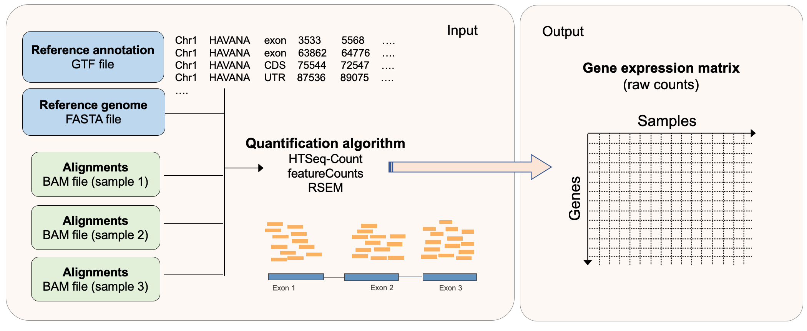
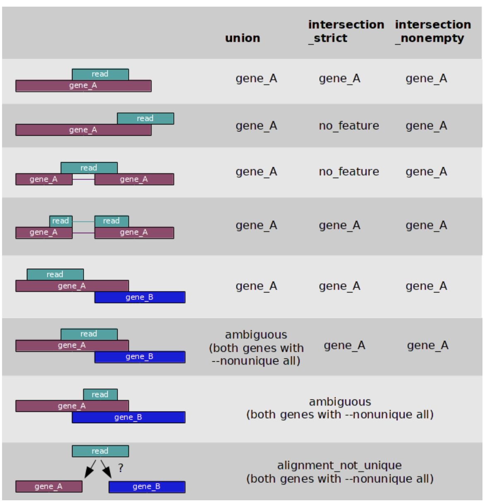
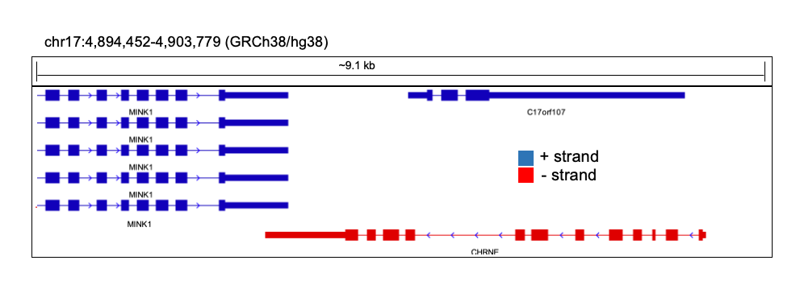
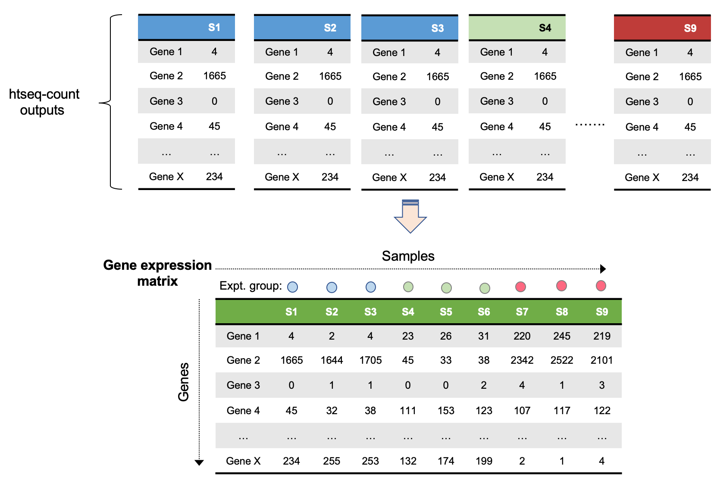
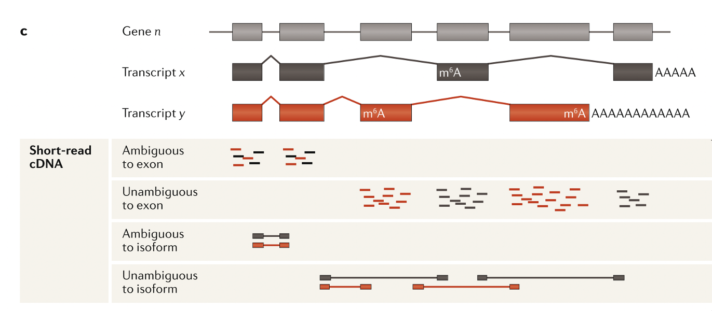

# Part 4 - Read count quantification

### Learning objectives:
- Gain understanding of how reads are counted to quantify expression levels in RNA-seq
- Learn how to quantify read counts using `htseq-count`
- Create a gene expression matrix from read count quantifications for the entire dataset

Make a new directory:
```bash
# go to our home worksp dir
rnaw

# make folder for quantification
mkdir results/quant
cd results/quant
```

If you get lost and need to catch up quickly you can copy the files needed for the next step with this command:

```bash
cp /dartfs-hpc/scratch/rnaseq1/data/htseq-count/* results/quant
```

## Principle of quantifying read counts for RNA-seq
In RNA-seq data analysis, we use the number of reads as a proxy for gene expression. Genes with many reads mapped to them are highly expressed in the original sample, while genes with few or no reads were lowly expressed. Therefore, in order to quantify expression levels in an RNA-seq dataset, we need some way of efficiently counting reads that are mapped to each gene.



A number of methods quantify expression levels by counting reads exist. These methods require a alignments (`.bam` file) and a genomic annotation (`GTF/GFF` file) that contains the coordinates of the features (genes) that we want to count over.

The most simplistic methods (e.g. [htseq-count](https://htseq.readthedocs.io/en/release_0.11.1/count.html), [featureCounts](http://subread.sourceforge.net/)) use a specific set of rules to count the number of reads overlapping specific features. These are a good choice if you wish to quantify gene expression levels, and are not interested in transcript abundances.

Other, more complex methods, leverage probabilistic modeling in order to quantify the alignments (e.g. [RSEM](https://deweylab.github.io/RSEM/)), which ascribes reads to features with a probability of this being the correct location for a given read. Generally, these methods are used if you wish to quantify transcript abundances, although can provide gene- and transcript-level estimates.

## HTSeq-count

For our analysis, we will used `htseq-count`. The `htseq-count`algorithm follows a specific set of rules to count reads overlapping genomic features, in order to quantify expression over those features (genes). As input, `htseq-count` requires:  
- Aligned sequencing reads (`SAM/BAM` file)
- List of genomic features (`GTF` file)

`htseq-count` has numerous options that can be specified to control its behaviour. One important feature that can be controlled is how `htseq-count` will count reads that overlap multiple features, for which it has three distinct modes: `union` (default), `intersection_strict`, and `intersection_nonempty`. You change change these using the `mode` option.

#### Counting modes (from the htseq-count documentation, found [here](https://htseq.readthedocs.io/en/release_0.11.1/count.html))

<p align="center">

</p>

**Strandedness:**  
One of the most important options in htseq-count is `strandedness`. It is critical to select the correct option for `strandedness` (`-s`) for your dataset, otherwise you may incorrectly use, or throw away, a lot of information.

The default setting in htseq-count for `strandedness` is `yes`, meaning reads will only be counted as overlapping a feature (exon of a gene) provided they map to the same strand as the feature.

If your data was generated using an unstranded library preparation protocol, as in this experiment, we must set this option to `no`. Failure to do so would mean you would throw away ~50% of all your reads, as they will be distributed equally across both strands for each feature in an unstranded library.  

<p align="center">

</p>

**Feature type:**  
Another important option in htseq-count is `t` or `type` which specifies which feature type (3rd column of a GTF file) you want to count features over. The default is `exon` which works for GTF files from Ensembl, such as the file we will be using. However, this can be changed to any feature in your GTF file, so theoretically can be used to count any feature you have annotated.


**Specifying BAM sorting:**  
When counting paired-end data (such as in this experiemnt) your `.bam` files should be sorted before running `htseq-count`, and you can specify how your `.bam` is sorted using the `-r` option. `name` indicates they are sorted by read name, `pos` indicates they are sorted by genomic position.

## Run htseq-count on your .bam file
```bash
htseq-count \
	-f bam \
	-s no \
	-r pos \
	--additional-attr "gene_name" \
	../alignment/SRR1039508_1.Aligned.sortedByCoord.out.chr20.bam \
	/dartfs-hpc/scratch/rnaseq1/refs/Homo_sapiens.GRCh38.97.chr20.gtf > SRR1039508.htseq-counts
	
	
# same command as above but without the newlines to separate the flags - only run one of these	
htseq-count -f bam -s no -r pos --additional-attr "gene_name" ../alignment/SRR1039508_1.Aligned.sortedByCoord.out.chr20.bam /dartfs-hpc/scratch/rnaseq1/refs/Homo_sapiens.GRCh38.97.chr20.gtf > SRR1039508.htseq-counts

```

There are numerous settings that can be tweaked and turned on/off in htseq-count. I strongly recommend you **read the manual** before running htseq-count so that you understand all the default options and available settings.

.... Let it run...

Lets have a look at the resulting file.
```bash
# how many lines
wc -l SRR1039508.htseq-counts

# first few rows
head SRR1039508.htseq-counts

# importantly, lets check the last few rows as these contain some important info
tail -n 12 SRR1039508.htseq-counts
```

Additional exercise:
- Can you visually confirm the read count returned in htseq-count by looking at the .bam file in IGV?

## Run htseq-count on the rest of our samples
```bash
ls ../alignment/*.Aligned.sortedByCoord.out.chr20.bam | while read x; do

  # save the file name
  sample=`echo "$x"`
  # get everything in file name before "/" (to remove '../alignment/')
  sample=`echo "$sample" | cut -d"/" -f3`
  # get everything in file name before "_"
  sample=`echo "$sample" | cut -d"." -f1`
  echo processing "$sample"

  htseq-count \
    -f bam \
    -s no \
    -r pos \
    --additional-attr "gene_name" \
    ../alignment/${sample}.Aligned.sortedByCoord.out.chr20.bam \
    /dartfs-hpc/scratch/rnaseq1/refs/Homo_sapiens.GRCh38.97.chr20.gtf > ${sample}.htseq-counts
done
```

## Generate the gene expression matrix of raw read counts

The final step in the pre-processing of RNA-seq data for differential expression analysis is to concatenate your read counts into a gene expression matrix that contains the counts from all your samples. We will do this at the command line, however there are also ways to directly read the output of programs like `htseq-count` and `RSEM` directly into R without concatenating them into a matrix before hand.



Loop over `htseq-count` output files and extract the read count column
```bash
# set up an array that we will fill with shorthand sample names
myarray=()

# loop over htseq.counts files and extract 2nd column (the raw read counts) using 'cut' command
while read x;  do
	# split up sample names to remove everything after "-"
	sname=`echo "$x"`
	sname=`echo "$sname" | cut -d"-" -f1`
	# extract second column of file to get read counts only
	echo counts for "$sname" being extracted
	cut -f3 $x > "$sname".tmp.counts
	# save shorthand sample names into an array  
	sname2="$sname"
	myarray+=($sname2)
done < <(ls -1 *.htseq-counts | sort)
```

Paste all gene IDs into a file with each to make the gene expression matrix
```bash
# extract ENSG gene IDs and gene names from one of the files
cut -f1-2 SRR1039508.htseq-counts > genes.txt

# use the paste command to put geneIDs and raw counts for all files in 1 file
paste genes.txt *.tmp.counts > tmp_all_counts.txt

# check it looks good
head tmp_all_counts.txt
```

Save sample names in the array into text file
```bash
# look at the contents of the array we made with shorthand sample names
echo ${myarray[@]}

# print contents of array into text file with each element on a new line
printf "%s\n" "${myarray[@]}" > col_names.txt
cat col_names.txt

# add 'gene_name' to colnames
cat <(echo "ENSEMBL_ID") <(echo "gene_name") col_names.txt > col_names_full.txt
cat col_names_full.txt
```

Put sample names in the file with counts to form row headers and complete the gene expression matrix
```bash
# make a file to fill
touch all_counts.txt

# use the 'cat' command (concatenate) to put all tmp.counts.txt files into all_counts.txt
cat <(cat col_names_full.txt | sort | paste -s) tmp_all_counts.txt > all_counts.txt

# view head of file
head all_counts.txt
tail all_counts.txt

# how many lines
wc -l all_counts.txt

# remove last five lines containing the extra quant info
head -n-5 all_counts.txt > all_counts_f.txt
wc -l all_counts_f.txt
```

Remove all the tmp files
```bash
rm -f *tmp*
```

In practice, you would have generated the `.htseq.counts` files using all genes accross the entire genome, and using all of the samples in the dataset, instead of the four samples we used in these examples. So that we have the complete set of counts available for day 2, we have made a complete raw counts matrix for you to use. You can find this in `/dartfs-hpc/scratch/rnaseq1/data/htseq-counts/`. It is also is the GitHub repository that you downloaded in the `Day-2` folder, as we will be loading it into `R` tomorrow for the differential expression analysis.

Have a quick look at it:
```bash
head /dartfs-hpc/scratch/rnaseq1/data/htseq-count/all_counts.txt

# how many lines
cat /dartfs-hpc/scratch/rnaseq1/data/htseq-count/all_counts.txt | wc -l

# add it to our quant directory
cp /dartfs-hpc/scratch/rnaseq1/data/htseq-count/all_counts.txt all_counts_full.txt

# also copy the below file as we will need it in the next lesson
cp /dartfs-hpc/scratch/rnaseq1/data/htseq-count/gene-lengths-grch38.tsv gene-lengths-grch38.tsv
```

### Quantification of transcript abundance

Above we discussed calculating abundances at the gene-level, however depending on your experiment, you may also be interested in determining individual transcript abundances. Calculating transcript abundances is more complex than gene-level counting, as not all reads span splice-junctions, therefore we cannot be sure which transcript they originated from.

<p align="center">

</p>


Figure from [Stark *et al*, 2019, *Nature Rev. Gen.*](https://www.nature.com/articles/nprot.2013.084)


Methods that generate transcript abundances use an estimation step in order to probabilistically estimate expression levels. [RSEM](https://deweylab.github.io/RSEM/) is a commonly used method for isoform abundance estimation, and uses an iterative process (expectation-maximization) to fractionally assign reads to individual isoforms.

Consider the example below from [Haas *et al*, 2013, *Nature Protocols.*](https://www.nature.com/articles/nprot.2013.084). Two isoforms for the same gene are shown, along with mapped reads (short bars). Reads unambiguously mapped to each isoform are in red & yellow, while blue reads are mapped to regions shared by both isoforms. The expectation-maximization algorithm uses the red and yellow reads to fractionally assign reads to each isoform (hollow vs filled-in reads on right).  

<p align="center">

</p>

Figure from [Haas *et al*, 2013, *Nature Protocols.*](https://www.nature.com/articles/nprot.2013.084)

In order to generate transcript abundances, tools like RSEM require **transcriptome alignments**, which contains read alignments based on transcript coordinates (compared to genome coordinates).

Previously we used STAR to generate a genome mapping, therefore to use RSEM to quantify transcript abundance, we would need to re-map our reads using additional setting in STAR. Transcriptome alignments can be output from STAR using the `quantmode` argument.

> Although transcript abundance estimation is generally more time consuming than gene-level counting, methods such as RSEM can collapse transcript estimates into gene-level abundances, [which has been shown to improve gene-level inferences](https://f1000research.com/articles/4-1521/v2).

### Additional exercise

Complete and run the code below to generate transcript quantification estimates using RSEM on one sample from our dataset.The majority of the code has been provided for you, however you should look at the documentation from STAR and RSEM to better understand the options used.

In addition, RSEM has not been included in your original conda environment (intentionally), so you must install it before completling the example below. Go to [the conda page for RSEM](https://anaconda.org/bioconda/rsem) to obtain the code needed to add RSEM to your conda environment. Note that this command may take a few minutes to run.


```bash
# set your current working directory to your own results/alignment directory
ADD CODE HERE

# run STAR again on the sample 'SRR1039508'
### NOTE the new option: '--quantMode'
STAR --genomeDir /dartfs-hpc/scratch/rnaseq1/refs/hg38_chr20_index \
  --readFilesIn ../trim/SRR1039508_1.trim.chr20.fastq.gz ../trim/SRR1039508_2.trim.chr20.fastq.gz \
  --readFilesCommand zcat \
  --sjdbGTFfile /dartfs-hpc/scratch/rnaseq1/refs/Homo_sapiens.GRCh38.97.chr20.gtf \
  --runThreadN 1 \
  --outSAMtype SAM \
  --outFilterType BySJout \
  --quantMode TranscriptomeSAM \
  --outFileNamePrefix SRR1039508.
```

You should now have a file called `SRR1039508.Aligned.toTranscriptome.out.bam` in your `alignments` directory. This file contains the transcriptome alignments of our reads to GRCh38.

Similarly to STAR, RSEM requires a specifically formatted version of the reference genome. The RSEM reference can be geneeated using teh RSEM command `rsem-prepare-reference`. **Do not run this command during the workshop** as it is time consuming. An RSEM formatted reference has been provided for you in `/dartfs-hpc/scratch/rnaseq1/refs/hg38_chr20_index_RSEM/`. Below is an example of the command used to generate this reference.

```bash
#### DO NOT RUN DURING WORKSHOP ####
rsem-prepare-reference --gtf /dartfs-hpc/scratch/rnaseq1/refs/Homo_sapiens.GRCh38.97.gtf \
                        -p 1 \
                        /dartfs-hpc/scratch/rnaseq1/refs/Homo_sapiens.GRCh38.dna.primary_assembly.chr20.fa \
                        hg38_chr20_index_RSEM/ref
```

Now navigate to your quantification directory (`quant`) and run RSEM on your transcriptome alignments, using the RSEM reference provided for you. `rsem-calculate-expression` is the command used by RSEM to quantify transcript expression.
```bash
# naigate to your quant directory
ADD CODE HERE

# run RSEM
rsem-calculate-expression --paired-end \
                          --alignments \
                          --strandedness none \
                          -p 1 \
                          ../alignments/SRR1039508.Aligned.toTranscriptome.out.bam \
                          /dartfs-hpc/scratch/rnaseq1/refs/hg38_chr20_index_RSEM/ref \
                          SRR1039508
```

Now have a look at the results:
```bash
# list files
ls

# print isoform quantification estimates
head SRR1039508.isoforms.results

# print gene quantification estimates
head SRR1039508.genes.results
```

RSEM provides both gene-level, and transcript/isoform-level quantification estimates. Use the [RSEM documentation](https://deweylab.github.io/RSEM/rsem-calculate-expression.html) to understand the fields in output files.
