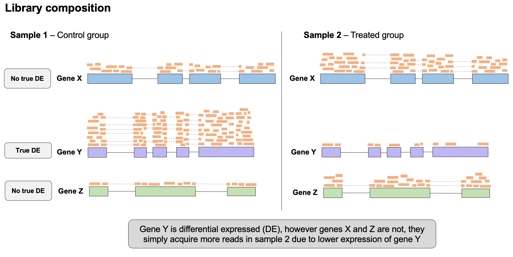

# Part 4 - Data normalization in RNA-seq

### Learning objectives:
- Understand why read counts must be normalized in RNA-seq data
- Learn the principles behind the major normalization strategies in RNA-seq and when to apply them
- Learn how to perform these normalization strategies

For this lesson we will work in the `quant/` directory we made previously:
```bash
# go to our home worksp dir
rnaw

# move into folder for quantification analysis
cd results/quant
```

If you get lost and need to catch up quickly you can copy the files needed for the next step with this command:

```bash
cp /scratch/rnaseq1/data/raw-fastq/htseq-count/* results/quant
```

## Count normalization in RNA-seq

In order to compare expression levels between genes within a sample, or genes across multiple samples, it is critical the data is normalized to allow appropriate interpretation of the results. Which normalization strategy depends on several factors such as the library type, as well as the comparison you wish to make (e.g. within- vs between-sample).

Below we will discuss the major sources of variation that need to be accounted for during normalization in order to reach appropriate conclusions about your results. Subsequently, we will discuss the normalization approaches that account for these sources of variation and when to use them.

### Gene length

Genes length typically varies a great deal across the genome of virtually all organisms.
In the below example, we see two genes, X and Y. If we were to simply compare the number of reads successfully mapped to gene X and gene Y, we would conclude gene X is expressed ~2x that of gene Y.

However, since gene X is ~2x longer than gene Y, gene X contributed ~2x as many RNA fragments to the original sequencing library. Gene X therefore only has more reads mapped to it because it is longer, **NOT** because it is truly expressed at greater level than gene Y.  

<p align="center">

</p>

To address gene length bias, we must normalize raw read counts in a way that accounts for the size of each gene. If we did this for gene X & gene Y, we would conclude their gene expression levels are similar.

Normalization for gene length is critical when comparing between genes **within the same sample**, however when comparing expression of the same gene **across different samples**, correction for gene length is not as important since we assume the gene is of the same length in all samples.

### Library size/sequencing depth  

Although samples are pooled together (each sample is tagged with a barcode and samples are combined) at similar concentrations in a sequencing run, some samples will end up being sequenced more than others, leading to slight differences in how many reads are produced for that sample, and therefore sequencing depth and size. Furthermore, if samples are sequenced on separate runs, their sequencing depths may be very different. If we don't account for this variation in sequencing depth, we might conclude some genes are expressed at greater levels in a sample that has simply been sequenced to a higher depth.  

<p align="center">

</p>


### Library composition

The presence of truly differentially expressed genes (in particular, DEGs with very large fold changes) between samples will cause the number of reads for other genes in those samples to be skewed. For example, in the below example, gene C is differentially expressed between the two samples, with much higher expression in sample 1. This high number of reads causes fewer reads to be detected for other genes in this sample, making it appear that these other genes are expressed at lower levels than in sample 2, however this is simply an artifact of library composition differences between the samples.

<p align="center">

</p>


## add in example of why RPKM is difficult to compare between samples
