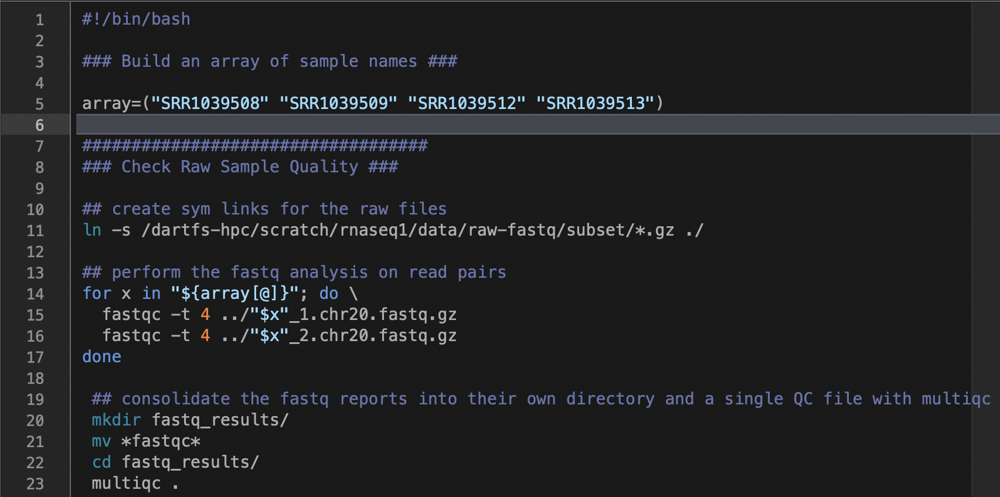

# Joining the workflow together  #
Just like experiments in the lab, it is important that you keep careful track of how your work was performed. To do this for computational analysis, we need to keep track of the commands used to perform an analysis.

One way to do this is by storing all your commands for a particular analysis in one file, and writing the commands in such a way that they are completed in succession, with each command using the output from the previous command.

One of the benefits of writing your code this way is the same code can be used over and over by simply providing the code with a different set of sample names. Code written this way is generally written, edited, and revised using a text editor (e.g. [Sublime text](https://www.sublimetext.com/) or [BBedit](https://www.barebones.com/products/bbedit/)).



## Exercise: complete the workflow

After you have completed the previous lessons & exercises (or as 'homework' after the workshop), we have provided the foundations of a simple script that links together commands from each part of the RNA-seq analysis we performed. Try filling in the rest of the commands to complete the workflow, and run it on the full dataset.

If you run into trouble leave a slack comment explaining your error(s) and we will do our best to get back to you!

To start out we are going to create an array with our sample names so that we can use the sample names to control the input and output of each of the commands.
Then we will use the array to write several for loops that iterate over the elements of the array to do something with them.

```bash
#!/bin/bash

### Build an array of sample names ###

array=("SRR1039508" "SRR1039509" "SRR1039512" "SRR1039513")

###################################
### Check Raw Sample Quality ###

## create sym links for the raw files
ln -s /dartfs-hpc/scratch/rnaseq1/data/raw-fastq/subset/*.gz ./

## perform the fastq analysis on read pairs
for x in "${array[@]}"; do \
  fastqc -t 4 ../"$x"_1.chr20.fastq.gz
  fastqc -t 4 ../"$x"_2.chr20.fastq.gz
done

 ## consolidate the fastq reports into their own directory and a single QC file with multiqc
 mkdir fastq_results/
 mv *fastqc*
 cd fastq_results/
 multiqc .

###################################
 ### Read Trimming ###

 ## create a directory for trimmed reads
 mkdir trim/
 cd trim/

 ## run the cutadapt command to trim reads
for x in "${array[@]}"; do \
 cutadapt \
  -o "$x"_1.trim.chr20.fastq.gz \
  -p "$x"_2.trim.chr20.fastq.gz \
  ../"$x"_1.chr20.fastq.gz ../"$x"_2.chr20.fastq.gz \
  -m 1 -q 20 -j 4 > "$x".cutadapt.report
done

###################################
### Read Alignment ###

## create a directory for aligned reads
mkdir alignment/
cd alignment

## run the STAR command to align reads (in this case the index has been built if you are using a different reference file you will need to add a command for building the reference
for x in "${array[@]}"; do \
    STAR --genomeDir /dartfs-hpc/scratch/rnaseq1/refs/hg38_chr20_index \
    --readFilesIn ../trim/"$x"_1.trim.chr20.fastq.gz ../trim/"$x"_2.trim.chr20.fastq.gz \
    --readFilesCommand zcat \
    --sjdbGTFfile /dartfs-hpc/scratch/rnaseq1/refs/Homo_sapiens.GRCh38.97.chr20.gtf \
    --runThreadN 4 \
    --outSAMtype BAM SortedByCoordinate \
    --outFilterType BySJout \
    --outFileNamePrefix "$x".
done

###################################
### Run CollectRNASeqMetrics ###

###################################
### Run MarkDuplicates ###

###################################
### Move alignment and metrics into a single directory and run multiqc ###

###################################
### Run htseq-count ###

```
