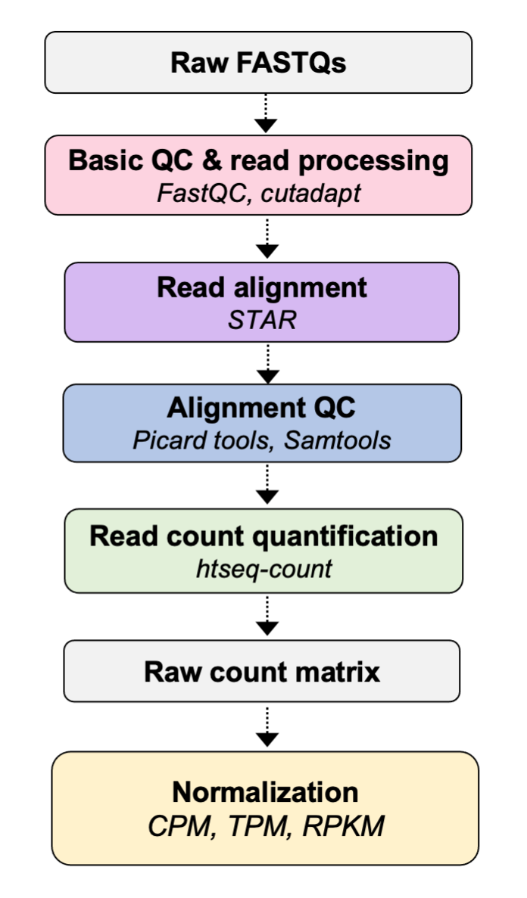

# Closing remarks

### Workshop goals:
- Develop a working understanding of the analytical workflow for a modern RNA-seq experiments
- Build a working knowledge of sample preparation considerations for RNA-seq experiments
- Learn how to process raw NGS data in FASTQ format to generate a gene expression matrix
- Learn how to perform a detailed quality control analysis

### Workshop overview

### Some final take-aways from the workshop:
- Spend the time to plan, consult, practice, (and money) to generate high quality data sets
- If you are going to do a lot of Bioinformatics, you should get **really** good at the command-line (Bash), otherwise, pre-processing will be slow & painful
- Identify, understand, and check key QC metrics to ensure the quality of your results
- Understand when and how to apply different normalization approaches.

### How to consolidate your learning:
- Re-run the code a week or two after the workshop, as this is a great way to consolidate what you have learned at the command-line
- Edit the code, run sub-sections, read the `man` pages for commands, etc. to build a solid understanding of how everything works
- Practice with the complete dataset (all chromosomes), that is available to you for approx. 1 month on discovery in `/scratch/rnaseq1/data/`. This will give you experience running data from the entire genome, and an appreciation for the computational resources and required time to complete these tasks.
- Read the methods sections of published papers that perform RNA-seq, to gain an appreciation for the range of approaches used in practice and how they are implemented
- Read reviews like (this one)[https://pubmed.ncbi.nlm.nih.gov/31341269/] from Stark *et al*, 2019, *Nat. Rev. Genetics*, `RNA Sequencing: The Teenage Years`.
- Ask us questions! (Bioinformatics office hours: https://dartmouth.zoom.us/s/96998379866, fridays at 1-2 pm, password: bioinfo)

### What next?

### Feedback:

We ask that you all complete the survey that will be sent out over email so that we can gauge what worked well and what we need to improve for our next workshop. If you have additional thoughts that were not addressed in the survey, please feel free to contact any one of us, or reach out to the DAC email directly (*DataAnalyticsCore@groups.dartmouth.edu*).

We plan to offer this workshop again, as well as workshops covering other types of genomic data analysis and bioinformatics. If you have suggestions for workshops you would like to see, please let us know!

Please feel free to reach out to us with questions about concepts discussed in the workshop, or for a analysis consultations. Our **bioinformatics office hours** on **Fridays 1-2pm** are a great place to do this! (currently on zoom: https://dartmouth.zoom.us/s/96998379866, pword: *bioinfo*)

### Now.. Final questions?
