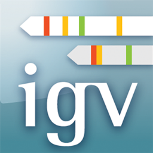

# Welcome to the RNA-seq Parimary Data Analysis workshop #

Before you attend the workshop there are a couple of things we would like you to do to get setup so you are able to participate in all sections of the workshop.  

For those of you that indicated you did not have an account on the [Dartmouth Discovery cluster](https://rc.dartmouth.edu/index.php/discovery-overview/) you should have received an email explaining how to set that up, please make sure this is done and you are able to log into your account **BEFORE** the workshop begins. **YOU WILL NEED A DISCOVERY ACCOUNT!**

## How to do this workshop ##

We will be using a dataset downloaded from the [Sequence Read Archive (SRA)](https://www.ncbi.nlm.nih.gov/sra), a public repository of genomic data. This dataset comes from [this paper](https://journals.plos.org/plosone/article?id=10.1371/journal.pone.0099625), and was collected from human airway smooth muscle cells to test gene pathways effected by exposure to Glucocorticoid drugs, which have been historically used for their anti-inflammatory effects to treat asthma.

All the teaching materials are located within the [GitHub repository](https://github.com/Dartmouth-Data-Analytics-Core/RNA-seq-Primary-Data-Analysis-workshop-June-2021). We suggest you bookmark this page so you can easily get back to this repository each day.

Lessons are provided in Markdown format (files with extension  `(.md)`) and also contain *'code chunks'* that you will use to perform the analysis of this dataset. The majority of analysis will be performed using a terminal application or emulator, with an open `ssh` connection to the Discovery cluster. You may copy and paste the code chunks into your terminal window to perform analyses, or type them out by hand.  

If you wish to edit, modify or save the code in its own file (as you would in a real analysis), this can be achieved using a Text Editor application. Numerous free text editors exist, such as [Sublime Text](https://www.sublimetext.com/), [BBEdit](https://www.barebones.com/products/bbedit/), and [Atom](https://atom.io/). Experimenting with your code in a text editor is an excellent way to learn, as well as document your work on a project.

The terminal application you use will depend on the operating system you are using. If you do not already have a terminal emulator on your machine, please download one. Below are some recommendations for different operating systems.

Operating system| Terminal emulators
---|---
Mac| Terminal (comes pre-installed)
Windows| [MobaXterm](https://mobaxterm.mobatek.net/download.html) <br> [PuTTY](https://www.chiark.greenend.org.uk/~sgtatham/putty/latest.html)
Linux| Konsole, Terminal, etc. (should be pre-installed but depends on the desktop environment you are running)


---

## Install the Integrative Genomics Viewer (IGV)

We will be using the [Integrative Genomics Viewer (IGV)](http://software.broadinstitute.org/software/igv/), a genome browser produced by researchers at the Broad Institute, to explore and visualize RNA-seq data.



You will need to download and install the IGV desktop application for your operating system before the workshop begins. The latest versions of IGV can be found at their [downloads page](http://software.broadinstitute.org/software/igv/download). After installing IGV, try opening the application on your computer to confirm the installation was successful.

---
## Installing an SFTP client ##

This is optional, but for those of you that are new to the command line, an SFTP client might be an easier way to move files between the HPC environment and your local machine. SFTP stands for Secure File Transfer Protocol and will enable you to drag and drop files as you might in a finder window between your local machine and a remote location, rather than using the command line.

Several free SFTP clients exist, such as [FileZilla](https://filezilla-project.org/download.php?show_all=1) [WinSCP](https://winscp.net/eng/index.phpby), and [Cyberduck](https://cyberduck.io/), among others.

---


## Setting up a Conda Environment ##

Conda is an open source package and environment manager that runs on Windows, MacOS and Linux. Conda allows you to install and update software packages as well as organize them efficiently into environments that you can switch between to manage software collections and versions.

We will be using Conda to make sure everyone has the required software to perform the analyses included in the workshop. To start using Conda on Discovery, open your terminal application and start an ssh connection using your username & password:

```bash
# Establish the secure shell connection
#### REPLACE 'netID' WITH THE ID ASSOCIATED WITH YOUR DISCOVERY ACCOUNT
ssh netID@discovery7.dartmouth.edu

# Enter your password at the prompt (when you type no characters will show up to preserve privacy)
netID@discovery7.dartmouth.edu password:

# You're in!
(base) [netID@discovery7 ~]$
```

Then run the following command:

```bash
source /optnfs/common/miniconda3/etc/profile.d/conda.sh
```

We recommend that you add the above line of code to your `.bashrc` file in your home directory, otherwise you will need to run this command each time you start a new session on discovery. To do this use the following code:

```bash
# navigate to your home directory
cd ~
# open the .bashrc file that is there
nano .bashrc
```
This will open the existing `.bashrc` file use the down arrow to move the cursor to the bottom of the file and paste `source /optnfs/common/miniconda3/etc/profile.d/conda.sh`. Then use the `ctrl + x` keys to exit the nano text editor, type `Y` to save the changes you made, and hit `return` to save the file to the same name (`.bashrc`).

Now run the following command to create a .conda/ directory in your home drive to store all of your personal conda environments. You only have to run this command once to make this directory, so it does not need to be added to your `.bashrc` file.

```bash
cd ~
mkdir -p .conda/pkgs/cache .conda/envs
```

Now create the conda environment that we will be using for the workshop. This takes about 15 minutes to complete. As you will see, many packages are being installed or updated, all managed for you by conda.

```bash
conda env create -f /scratch/rnaseq1/rnaseqw.yml
```

When you are ready activate the conda environment, use the following command:

```bash
conda activate rnaseq_w
```

You will see that the activate command has worked when it reads `rnaseq_w` rather than `base` to the left of the prompt.

When you are finished using a conda environment, it is good practice to deactivate your session with the following command.

```bash
conda deactivate
```

Thats it! This conda environment contains all the software you will need during the workshop. If you run into issues with the setup, please reach out to us at *DataAnalyticsCore@groups.dartmouth.edu* and someone will be in touch to assist you.

**NOTE:** Dartmouth's Research Computing team also provides instructions for getting started with Conda on discovery, which you can find [here](https://services.dartmouth.edu/TDClient/1806/Portal/KB/ArticleDet?ID=72888).
